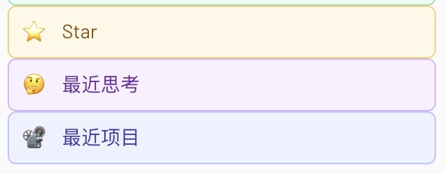
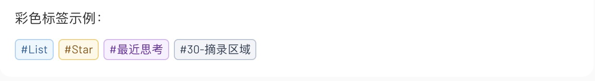

# flomo 彩色标签

为 flomo 网页端标签添加稳定、可自定义的颜色。扩展只在浏览器本地运行。





> 示例截图仅用于展示侧边栏和正文标签的配色效果。

## 功能

- 只为指定标签及其下级标签着色，未设置的标签保持原样。
- 支持预设色和自定义十六进制颜色。
- 支持侧边栏、正文标签、深色模式和动态加载。
- 保留 flomo 原生绿色选中状态和标签输入候选高亮。
- 提供可编辑的中文、英文和中英文混合入门模板，默认安全合并。
- 支持规则搜索、颜色筛选、层级展示和批量添加。
- 支持带版本与日期元数据的配置备份，并兼容恢复旧版导出 JSON。

## 安装

1. 下载或克隆本项目。
2. 打开 `chrome://extensions` 或 `vivaldi://extensions`。
3. 开启“开发者模式”，选择“加载已解压的扩展程序”。
4. 选择项目目录，然后刷新 flomo 网页。
5. 从扩展详情进入“扩展程序选项”，添加标签和颜色。

## 设置与更新

- 颜色设置保存在当前浏览器的 `chrome.storage.local` 中；重新加载扩展、更新代码或重启浏览器不会清空设置。
- 删除扩展、换浏览器或换电脑前，请先备份配置，再在新环境中恢复。
- 修改代码后，在扩展管理页点击“重新加载”，然后刷新 flomo。

## 权限与隐私

- 扩展使用 `storage` API 在浏览器本地保存配色设置。
- 内容脚本仅在 `https://flomoapp.com/*` 和 `https://*.flomoapp.com/*` 中运行，用于识别并着色标签相关的页面元素。
- 标签识别和配色都在浏览器本地完成；扩展不调用 flomo API，不上传内容，也不保存笔记正文。

## 测试

```bash
npm ci
node --test tests/tag-colors.test.js
```
